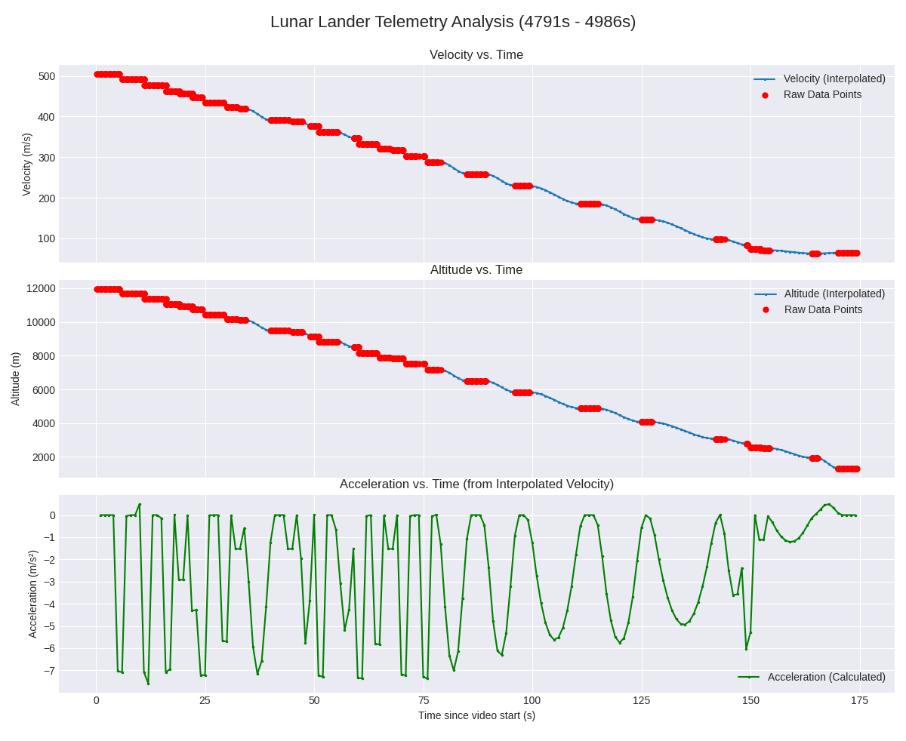

# ispace

ispace is a Python-based tool for extracting telemetry data from Firefly Aerospace's landing video. It uses OCR to parse telemetry data such as velocity, altitude, and time from video streams or local files. The extracted data is processed, interpolated, and visualized for analysis. Similar repo by [fireflyXtract](https://github.com/chandrabhraman/fireflyxtract/tree/main)


---

## Features

- Works for both the first and the second landing attempt.
- Extract telemetry data from video streams or local files.
- Perform OCR on specific regions of interest (ROIs) in the video.
- Uses physical constraints like derived speed and acceleration lying in expected ranges to drop bad data
- Interpolate data to N-second intervals for smooth analysis.
- Generate plots for velocity, altitude, and acceleration (d/dt(speed)) over time.
- Save extracted data for reuse in `.npz` format.

---

## Installation

### Prerequisites

Ensure you have the following installed:

- Python 3.8 or higher (tested in 3.13.2)
- [FFmpeg](https://ffmpeg.org/) (must be in your system's PATH)
- [Tesseract OCR](https://github.com/tesseract-ocr/tesseract) (required for OCR functionality)

### Install Required Python Modules

Clone the repository and navigate to the `ispace` directory:

```bash
git clone https://github.com/chandrabhraman/ispace.git
cd ispace/ispace
```

### Install the required Python modules using pip:
```bash
pip install -r [requirements.txt]
```

### Usage
To extract telemetry data, run the get_telemetry_firefly.py script with the following arguments:

```bash
python3 [get_telemetry_ispace.py/get_telemetry_ispace_second_attempt.py] <video_url> <start_time> <end_time> <bbox_time> <bbox_vel> <bbox_alt> <bbox_alt_units> [--stream_quality <quality>] [--flight_data_path <path>]
```
ispace 2nd mission:


Arguments
`video_url`: URL of the YouTube video or path to a local video file.  
`start_time`: Start time in the video (in seconds).  
`end_time`: End time in the video (in seconds).  
`bbox_time`: Bounding box for the "Time to Go" field (format: x,y,w,h).  
`bbox_vel`: Bounding box for the "Velocity" field (format: x,y,w,h).  
`bbox_alt`: Bounding box for the "Altitude" field (format: x,y,w,h).  
`bbox_alt_units`: Bounding box for the "Altitude Units" field (format: x,y,w,h).  

Optional Arguments  
`--stream_quality`: Desired stream quality (e.g., 720p, 1080p, best). Default is 1080p   
`--flight_data_path`: Path to save extracted flight data in .npz format. Default is flight_data.npz.

Example

To analyze ispace's 1st mission:
```bash
python3 get_telemetry_ispace.py "https://www.youtube.com/watch?v=y4Zp1OjP93U" 4044 4195 "1737,374,120,31" "1593,243,79,46" "1756,239,88,52" "1784,289,36,23"
```

To analyze ispace's 2nd mission:
```bash
python3 get_telemetry_ispace_second_attempt.py "https://www.youtube.com/watch?v=BVSMXQPeTcw&t=4962s" 4791 4986 "1738,451,132,28" "1554,269,86,37" "1753,268,101,36" "1787,308,26,23"
```
### Result plots



## Scope of improvement
Better template matching for the telemetry would help. Open to PRs.

## Credits
Credit to the ispace feeds Youtube [video1](https://www.youtube.com/watch?v=y4Zp1OjP93U) and [video2](https://www.youtube.com/watch?v=BVSMXQPeTcw&t=4962s).